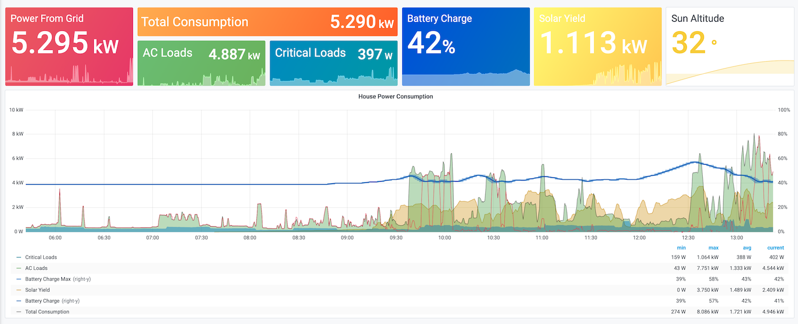

# Victron Prometheus Exporter

A Prometheus/OpenMetrics exporter to Victron's CC GX module, using MQTT.

Works locally and with the VRM portal.

Here is an example of the kind of dashboard you can build using the information provided by this
exporter. This example is built in Grafana.



## Usage

### Local Usage

You will need to enable MQTT on your Victron CC GX module.

Then run:

```console
$ victron-exporter -mqtt.host $IP_ADDRESS_OF_VICTRON_MODULE
...
```

### VRM Portal Usage

``` console
$ victron-exporter \
  -mqtt.host mqttXX.victronenergy.com \
  -mqtt.username $VRM_PORTAL_USERNAME \
  -mqtt.password $VRM_PORTAL_PASSWORD
...
```

## Output

By default, the exporter will listen on port 9226. This can be configured through
the `-web.listen-address` parameter.

Here are some of the value that are returned from my new installation:

```console
$ curl localhost:9226/metrics|grep victron_
# HELP victron_ac_active_input_phase_current_amps Current
# TYPE victron_ac_active_input_phase_current_amps gauge
victron_ac_active_input_phase_current_amps{component_id="257",component_type="vebus",phase="1"} 3.0199999809265137
# HELP victron_ac_active_input_phase_power_watts Real power
# TYPE victron_ac_active_input_phase_power_watts gauge
victron_ac_active_input_phase_power_watts{component_id="257",component_type="vebus",phase="1"} 698
# HELP victron_ac_active_input_phase_voltage_volts
# TYPE victron_ac_active_input_phase_voltage_volts gauge
victron_ac_active_input_phase_voltage_volts{component_id="257",component_type="vebus",phase="1"} 233.74000549316406
# HELP victron_ac_active_input_power_watts Total power
# TYPE victron_ac_active_input_power_watts gauge
victron_ac_active_input_power_watts{component_id="257",component_type="vebus"} 698
# HELP victron_ac_consumption_on_input_phase_power_watts W
# TYPE victron_ac_consumption_on_input_phase_power_watts gauge
victron_ac_consumption_on_input_phase_power_watts{component_id="0",component_type="system",phase="1"} 2152.5
# HELP victron_ac_consumption_on_output_phase_power_watts W
# TYPE victron_ac_consumption_on_output_phase_power_watts gauge
victron_ac_consumption_on_output_phase_power_watts{component_id="0",component_type="system",phase="1"} 679
# HELP victron_ac_consumption_phase_power_watts Total of ConsumptionOnInput & ConsumptionOnOutput
# TYPE victron_ac_consumption_phase_power_watts gauge
victron_ac_consumption_phase_power_watts{component_id="0",component_type="system",phase="1"} 2831.5
# HELP victron_ac_current_amps A AC - Deprecated
# TYPE victron_ac_current_amps gauge
victron_ac_current_amps{component_id="30",component_type="grid"} 12.32
# HELP victron_ac_energy_forward_kwh kWh  - Total produced energy over all phases
# TYPE victron_ac_energy_forward_kwh gauge
victron_ac_energy_forward_kwh{component_id="30",component_type="grid"} 285.3
# HELP victron_ac_energy_phase_reverse_kwh
# TYPE victron_ac_energy_phase_reverse_kwh gauge
victron_ac_energy_phase_reverse_kwh{component_id="30",component_type="grid",phase="1"} 0
victron_ac_energy_phase_reverse_kwh{component_id="30",component_type="grid",phase="2"} NaN
victron_ac_energy_phase_reverse_kwh{component_id="30",component_type="grid",phase="3"} NaN
# HELP victron_ac_energy_reverse_kwh
# TYPE victron_ac_energy_reverse_kwh gauge
victron_ac_energy_reverse_kwh{component_id="30",component_type="grid"} 0
# HELP victron_ac_grid_phase_power_watt
# TYPE victron_ac_grid_phase_power_watt gauge
victron_ac_grid_phase_power_watt{component_id="0",component_type="system",phase="1"} 2850.5
# HELP victron_ac_output_phase_current_amps AC Output current
# TYPE victron_ac_output_phase_current_amps gauge
victron_ac_output_phase_current_amps{component_id="257",component_type="vebus",phase="1"} 2.6500000953674316
# HELP victron_ac_output_phase_freq_hz AC Output frequency Hertz
# TYPE victron_ac_output_phase_freq_hz gauge
victron_ac_output_phase_freq_hz{component_id="257",component_type="vebus",phase="1"} 49.948848724365234
# HELP victron_ac_output_phase_power_watts Not used on vedirect inverters
# TYPE victron_ac_output_phase_power_watts gauge
victron_ac_output_phase_power_watts{component_id="257",component_type="vebus",phase="1"} 679
# HELP victron_ac_output_phase_volts AC Output voltage
# TYPE victron_ac_output_phase_volts gauge
victron_ac_output_phase_volts{component_id="257",component_type="vebus",phase="1"} 233.74000549316406
# HELP victron_ac_output_power_watts AC Output power watts
# TYPE victron_ac_output_power_watts gauge
victron_ac_output_power_watts{component_id="257",component_type="vebus"} 679
# HELP victron_ac_phase_current A AC
# TYPE victron_ac_phase_current gauge
victron_ac_phase_current{component_id="30",component_type="grid",phase="1"} 12.32
# HELP victron_ac_phase_current_amps A AC
# TYPE victron_ac_phase_current_amps gauge
victron_ac_phase_current_amps{component_id="30",component_type="grid",phase="2"} NaN
victron_ac_phase_current_amps{component_id="30",component_type="grid",phase="3"} NaN
# HELP victron_ac_phase_energy_forward_kwh kWh
# TYPE victron_ac_phase_energy_forward_kwh gauge
victron_ac_phase_energy_forward_kwh{component_id="30",component_type="grid",phase="1"} 285.3
victron_ac_phase_energy_forward_kwh{component_id="30",component_type="grid",phase="2"} NaN
victron_ac_phase_energy_forward_kwh{component_id="30",component_type="grid",phase="3"} NaN
# HELP victron_ac_phase_power_watts W
# TYPE victron_ac_phase_power_watts gauge
victron_ac_phase_power_watts{component_id="30",component_type="grid",phase="1"} 2850.5
victron_ac_phase_power_watts{component_id="30",component_type="grid",phase="2"} NaN
victron_ac_phase_power_watts{component_id="30",component_type="grid",phase="3"} NaN
# HELP victron_ac_phase_voltage_volts V AC
# TYPE victron_ac_phase_voltage_volts gauge
victron_ac_phase_voltage_volts{component_id="30",component_type="grid",phase="1"} 234.3
victron_ac_phase_voltage_volts{component_id="30",component_type="grid",phase="2"} NaN
victron_ac_phase_voltage_volts{component_id="30",component_type="grid",phase="3"} NaN
# HELP victron_ac_power_watts W    - Total power of all phases, preferably real power
# TYPE victron_ac_power_watts gauge
victron_ac_power_watts{component_id="30",component_type="grid"} 2850.5
# HELP victron_ac_voltage_volts V AC - Deprecated
# TYPE victron_ac_voltage_volts gauge
victron_ac_voltage_volts{component_id="30",component_type="grid"} 234.3
# HELP victron_alarm 0=OK; 1=Warning; 2=Alarm
# TYPE victron_alarm gauge
victron_alarm{alarm_type="CellImbalance",component_id="512",component_type="battery"} 0
victron_alarm{alarm_type="HighChargeCurrent",component_id="512",component_type="battery"} 0
victron_alarm{alarm_type="HighChargeTemperature",component_id="512",component_type="battery"} 0
victron_alarm{alarm_type="HighDischargeCurrent",component_id="512",component_type="battery"} 0
victron_alarm{alarm_type="HighTemperature",component_id="512",component_type="battery"} 0
victron_alarm{alarm_type="HighVoltage",component_id="512",component_type="battery"} 0
victron_alarm{alarm_type="InternalFailure",component_id="512",component_type="battery"} 0
victron_alarm{alarm_type="LowChargeTemperature",component_id="512",component_type="battery"} 0
victron_alarm{alarm_type="LowTemperature",component_id="512",component_type="battery"} 0
victron_alarm{alarm_type="LowVoltage",component_id="512",component_type="battery"} 0
# HELP victron_battery_low_voltage Note that Low Voltage is ignored by the system (BYD, Lynx BMS and FreedomWon)
# TYPE victron_battery_low_voltage gauge
victron_battery_low_voltage{component_id="512",component_type="battery"} 42
# HELP victron_dc_battery_current
# TYPE victron_dc_battery_current gauge
victron_dc_battery_current{component_id="0",component_type="system"} 0.5
# HELP victron_dc_battery_power_watts
# TYPE victron_dc_battery_power_watts gauge
victron_dc_battery_power_watts{component_id="0",component_type="system"} 27
# HELP victron_dc_battery_temperature_celsius
# TYPE victron_dc_battery_temperature_celsius gauge
victron_dc_battery_temperature_celsius{component_id="0",component_type="system"} 22.399999618530273
# HELP victron_dc_battery_voltage_volts
# TYPE victron_dc_battery_voltage_volts gauge
victron_dc_battery_voltage_volts{component_id="0",component_type="system"} 55.2400016784668
# HELP victron_dc_current_amps A DC
# TYPE victron_dc_current_amps gauge
victron_dc_current_amps{component_id="256",component_type="solarcharger",n="0"} 0.5
victron_dc_current_amps{component_id="258",component_type="solarcharger",n="0"} 0.30000001192092896
victron_dc_current_amps{component_id="512",component_type="battery",n="0"} 0.5
# HELP victron_dc_power_watts
# TYPE victron_dc_power_watts gauge
victron_dc_power_watts{component_id="257",component_type="vebus",n="0"} 20
victron_dc_power_watts{component_id="512",component_type="battery",n="0"} 27
# HELP victron_dc_pv_current_amps
# TYPE victron_dc_pv_current_amps gauge
victron_dc_pv_current_amps{component_id="0",component_type="system"} 0.800000011920929
# HELP victron_dc_pv_power_watts
# TYPE victron_dc_pv_power_watts gauge
victron_dc_pv_power_watts{component_id="0",component_type="system"} 44.233999911308274
# HELP victron_dc_temperature_celsius °C - Battery temperature
# TYPE victron_dc_temperature_celsius gauge
victron_dc_temperature_celsius{component_id="512",component_type="battery",n="0"} 22.399999618530273
# HELP victron_dc_vebus_power_watts
# TYPE victron_dc_vebus_power_watts gauge
victron_dc_vebus_power_watts{component_id="0",component_type="system"} 20
# HELP victron_dc_voltage_volts V DC
# TYPE victron_dc_voltage_volts gauge
victron_dc_voltage_volts{component_id="256",component_type="solarcharger",n="0"} 55.29999923706055
victron_dc_voltage_volts{component_id="257",component_type="vebus",n="0"} 55.279998779296875
victron_dc_voltage_volts{component_id="258",component_type="solarcharger",n="0"} 55.279998779296875
victron_dc_voltage_volts{component_id="512",component_type="battery",n="0"} 55.2400016784668
# HELP victron_error_code
# TYPE victron_error_code gauge
victron_error_code{component_id="30",component_type="grid"} 0
# HELP victron_history_charged_energy_kwh
# TYPE victron_history_charged_energy_kwh gauge
victron_history_charged_energy_kwh{component_id="512",component_type="battery"} NaN
# HELP victron_history_discharge_energy_kwh
# TYPE victron_history_discharge_energy_kwh gauge
victron_history_discharge_energy_kwh{component_id="512",component_type="battery"} NaN
# HELP victron_max_charge_current_amps Charge Current Limit aka CCL  (BYD, Lynx BMS and FreedomWon)
# TYPE victron_max_charge_current_amps gauge
victron_max_charge_current_amps{component_id="512",component_type="battery"} 90
# HELP victron_max_charge_voltage_volts Maximum voltage to charge to (BYD, Lynx BMS and FreedomWon)
# TYPE victron_max_charge_voltage_volts gauge
victron_max_charge_voltage_volts{component_id="512",component_type="battery"} 61.5
# HELP victron_max_discharge_current_amps Discharge Current Limit aka DCL (BYD, Lynx BMS and FreedomWon)
# TYPE victron_max_discharge_current_amps gauge
victron_max_discharge_current_amps{component_id="512",component_type="battery"} 300
# HELP victron_pv_array_current_amps PV current (= /Yield/Power divided by /Pv/V)
# TYPE victron_pv_array_current_amps gauge
victron_pv_array_current_amps{component_id="256",component_type="solarcharger"} 0.2994768023490906
victron_pv_array_current_amps{component_id="258",component_type="solarcharger"} 0.19465935230255127
# HELP victron_pv_array_voltage_volts PV array voltage
# TYPE victron_pv_array_voltage_volts gauge
victron_pv_array_voltage_volts{component_id="256",component_type="solarcharger"} 87.91999816894531
victron_pv_array_voltage_volts{component_id="258",component_type="solarcharger"} 80.13999938964844
# HELP victron_state
# TYPE victron_state gauge
victron_state{component_id="0",component_type="hub4"} 11
# HELP victron_state_of_charge 0 to 100 % (BMV, BYD, Lynx BMS)
# TYPE victron_state_of_charge gauge
victron_state_of_charge{component_id="512",component_type="battery"} 41
# HELP victron_system_max_cell_voltage_volts
# TYPE victron_system_max_cell_voltage_volts gauge
victron_system_max_cell_voltage_volts{component_id="512",component_type="battery"} NaN
# HELP victron_system_min_cell_voltage_volts
# TYPE victron_system_min_cell_voltage_volts gauge
victron_system_min_cell_voltage_volts{component_id="512",component_type="battery"} NaN
# HELP victron_time_on_grid_seconds_total Time spent on grid
# TYPE victron_time_on_grid_seconds_total counter
victron_time_on_grid_seconds_total{component_id="0",component_type="system"} 50
# HELP victron_yield_power_watts Actual input power (Watts)
# TYPE victron_yield_power_watts gauge
victron_yield_power_watts{component_id="256",component_type="solarcharger"} 26.280000686645508
victron_yield_power_watts{component_id="258",component_type="solarcharger"} 15.779999732971191
```

## Hacking on `victron-exporter`

1. This project uses [`asdf`](https://asdf-vm.com/) for tool version management. All the build dependencies should be expressed in the `.tool-versions` file. Once you have `asdf` setup, run `scripts/install-asdf-plugins.sh` to install all required `asdf` plugins.
1. This project use [`pre-commit`](https://pre-commit.com/) to perform basic checks and lints of the codebase. The checks will be run in CI using GitHub Actions, but you can also install `pre-commit` locally for faster feedback.

### License

Copyright 2020, Andrew Newdigate

Permission is hereby granted, free of charge, to any person obtaining a copy of this software and associated documentation files (the "Software"), to deal in the Software without restriction, including without limitation the rights to use, copy, modify, merge, publish, distribute, sublicense, and/or sell copies of the Software, and to permit persons to whom the Software is furnished to do so, subject to the following conditions:

The above copyright notice and this permission notice shall be included in all copies or substantial portions of the Software.

THE SOFTWARE IS PROVIDED "AS IS", WITHOUT WARRANTY OF ANY KIND, EXPRESS OR IMPLIED, INCLUDING BUT NOT LIMITED TO THE WARRANTIES OF MERCHANTABILITY, FITNESS FOR A PARTICULAR PURPOSE AND NONINFRINGEMENT. IN NO EVENT SHALL THE AUTHORS OR COPYRIGHT HOLDERS BE LIABLE FOR ANY CLAIM, DAMAGES OR OTHER LIABILITY, WHETHER IN AN ACTION OF CONTRACT, TORT OR OTHERWISE, ARISING FROM, OUT OF OR IN CONNECTION WITH THE SOFTWARE OR THE USE OR OTHER DEALINGS IN THE SOFTWARE.
